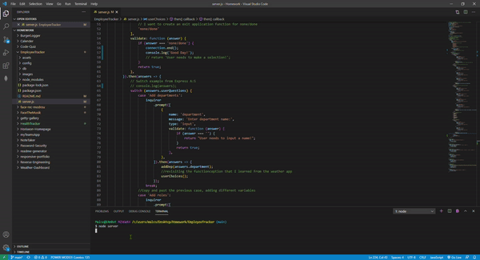

# 
EmployeeTracker

The goal for the Employee Tracker app is to add, view, and update employees database.
* [Github Repository] (https://github.com/malhill/EmployeeTracker)

## JS
* 

## MYSQL
* created db and employee_tracker files 
* tested the tables by using MySql workbench

## NPM
* used npm init -y, npm i mysql
